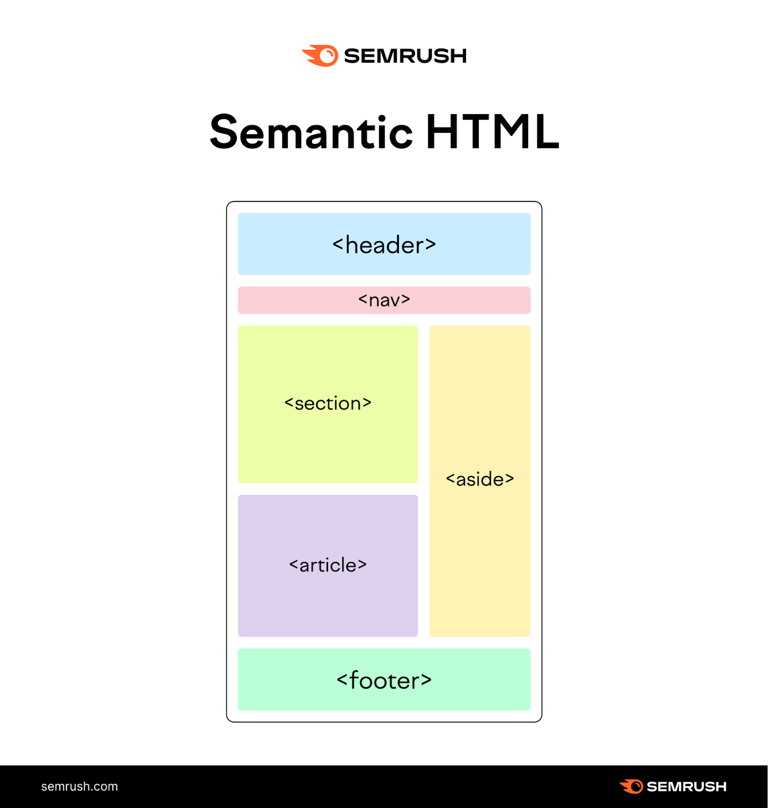

# Oppgave Uke35/36

Dere skal i denne oppgaven lage en fagpresentasjon nettside.
Hvert fagtema skal være sin egen html side.

 

**NB! Sjekk Måloppnåelse for ekstra krav**

 

I tilegg til faginnholdet skal nettsiden ha lik stil/utseende på alle sider.
Nettsiden skal også bruke følgende Semantiske elementer:

 

|Html Semantic Element|Kommentar|
|:--------------------|--------:|
|`<Header>`|Logo/Navn på nettsiden|
|`<Nav>`|Linker til de andre sidene|
|`<Article>`|Faginformasjonen som skal skrives|
|`<Footer>`|Informasjon på bunnen av nettsiden|

 

## Sider som nettsiden **SKAL** ha med

Sidene og faginnholdet som skal være med er følgende:
- Hjem
- Grunnlegende Programmerings Prinsipper (Variabler, Datatyper/Operatorer, Kontrollflyt, - - Løkker, Funksjoner, Arrays, Objekter)
- HTTP
- Node
- About Me

 

# Måloppnåelse

|Lav|Middels|Høy|
|:--|:------|--:|
|Har tatt i bruk semantiske elementer|Har brukt semantiske elementer riktig og konsist på alle sider|I tilegg har riktig nested de semantiske elementene|
|Har laget en side og skrevet teori rundt hvert fagord|Har i tilegg lagt til bilde/diagram og forklarer hved bruk av dette| I tilegg lagt til et eksempel scenario eller begrunnet hvorfor vi bruker det|
|Brukt grunnlegende css for å endre farge,font,størelse osv på elementer|Har i tilegg brukt flexboks til å aligne elementer riktig på siden| Har i tilegg brukt grid sammen med flexboks for å gjøre siden mer mobilvennlig|

